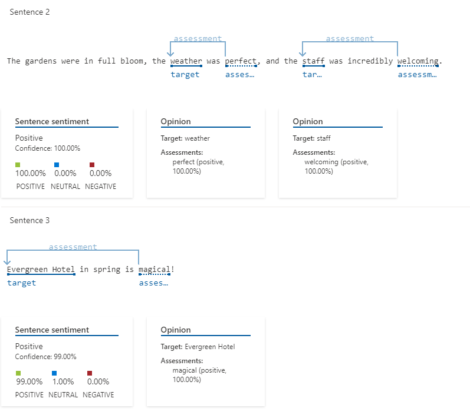
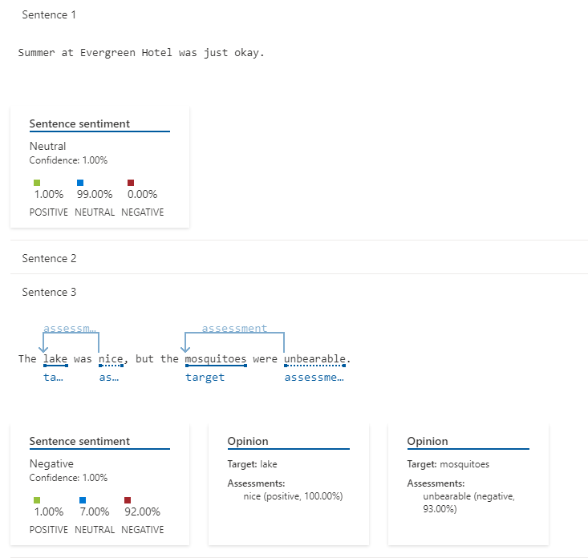
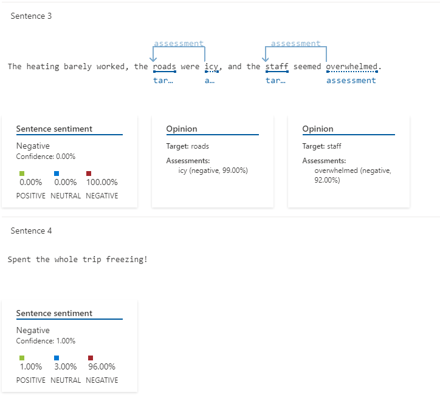

#  **Hosting Rating**

Este projeto simula a análise de avaliações geradas por uma IA da Azure sobre a qualidade de uma hospedagem ao longo do ano, levando em conta as diferentes estações e como elas impactam a experiência dos hóspedes.

## 📌 **Fator principal que afeta a experiência: a época do ano**

A qualidade da hospedagem pode variar significativamente com as mudanças nas estações do ano. A IA foi capaz de analisar essas variações, destacando as melhores, medianas e piores épocas para visitar, com base nas avaliações dos hóspedes.

### 🔍 **Análise da IA:**
A IA foi utilizada para avaliar as avaliações dos hóspedes ao longo do ano e identificar os pontos fortes e fracos da hospedagem conforme as estações mudam. Com essas informações, foram extraídas conclusões sobre o impacto da época do ano na experiência de hospedagem.

---

##  **Melhores épocas para visitar**

### 🌸 **Primavera**

Durante a primavera, o hotel se destaca pela recepção calorosa e pelo clima ameno, proporcionando uma experiência confortável para os hóspedes.

### 🍂 **Outono**

Assim como na primavera, o outono oferece um ambiente acolhedor, especialmente com o uso de lareiras, tornando a experiência ainda mais agradável para quem busca aconchego.

---

## ⚖ **Época mediana**

### 🏖️ **Verão**

No verão, apesar de alguns pontos positivos, surgem imprevistos que afetam a experiência dos hóspedes, como o aumento da população de mosquitos, o que torna a estadia menos confortável.

---

##  **Pior época para visitar**

### ☃️ **Inverno**

Durante o inverno, a hospedagem se torna um verdadeiro desafio devido a:
- Estradas congeladas, dificultando o acesso 🚗❄️
- Sobrecarga da equipe, afetando o atendimento 🏨
- Mau funcionamento dos aquecedores, prejudicando o conforto térmico 🚫

---

## 🛠️ **Medidas para melhorar a hospedagem**

### 🌸 **Primavera & 🍂 Outono:**
- ✅ Aumentar a divulgação da hospedagem para atrair mais visitantes 📢
- ✅ Ajustar preços para aproveitar a alta demanda 💰

### 🏖️ **Verão:**
- ✅ Alertar os hóspedes sobre a presença de mosquitos para garantir sua preparação ⚠️

### ☃️ **Inverno:**
- ✅ Reforçar a equipe para lidar melhor com a alta demanda 👥
- ✅ Verificar o funcionamento dos aquecedores e garantir que tudo esteja operando corretamente antes da temporada ❄️🔥

---

## 📌 **Conclusão:**

A época do ano tem um grande impacto na experiência da hospedagem, e a análise feita pela IA da Azure permitiu extrair insights valiosos para aprimorar os serviços e auxiliar na escolha do melhor período para visitação. Utilizar esses insights pode beneficiar tanto os hóspedes, permitindo uma escolha mais informada sobre quando visitar, quanto os administradores do hotel, que podem tomar medidas para melhorar a experiência e o conforto de seus hóspedes.

---

## 🧠 **Insights e Possibilidades**

- **Análise Inteligente de Dados**: A IA analisou as avaliações para destacar os melhores e piores períodos do ano, proporcionando uma visão estratégica de como melhorar a hospedagem.
- **Ajustes Personalizados**: A capacidade de personalizar o atendimento e melhorar os serviços de acordo com as épocas do ano é uma vantagem para os gestores de hospedagem.
- **Oportunidades de Aprendizado**: O uso da IA para identificar pontos fortes e fracos na experiência do hóspede oferece oportunidades de aprendizado contínuo e adaptação.
