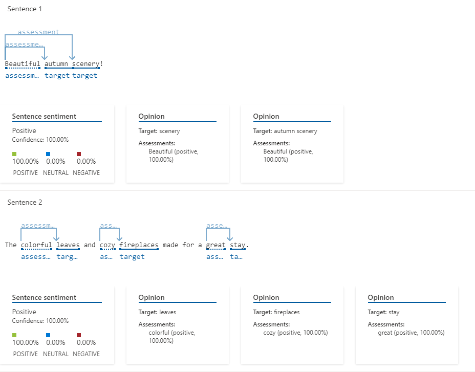

# 🌟 Hosting Rating  

Este projeto simula a análise de avaliações geradas por uma IA da Azure sobre a qualidade de uma hospedagem ao longo do ano.  

## 📌 Fator principal que afeta a experiência: a época do ano  

A qualidade da hospedagem pode variar significativamente de acordo com a estação do ano. Com base nisso, é possível identificar:  
✔️ **Melhores épocas para visitar**  
⚖️ **Épocas medianas**  
❌ **Piores épocas para visitar**  

---

##  Melhores épocas para visitar  

### **🌸 Primavera**  
  

Durante a primavera, o hotel se torna extremamente atrativo devido à recepção calorosa e ao clima agradável.  

### **🍂 Outono**  
  

Assim como na primavera, o hotel oferece uma experiência aconchegante, destacando-se por suas lareiras acolhedoras.  

---

##  Época mediana  

### **🏖️ Verão**  
  

O hotel possui pontos positivos, mas alguns imprevistos surgem, como o aumento da população de mosquitos, tornando a estadia menos confortável.  

---

##  Pior época para visitar  

### **☃️ Inverno**  
  

Durante o inverno, a hospedagem se torna um verdadeiro desafio devido a:  
- Estradas congeladas dificultando o acesso 🚗❄️  
- Equipe sobrecarregada 🏨 
- Mal funcionamento dos aquecedores 🚫  

---

## 🛠️ Medidas para melhorar a hospedagem  

### **🌸 Primavera & 🍂 Outono:**  
✅ Aumentar a divulgação da hospedagem 📢  
✅ Ajustar preços para aproveitar a alta demanda 💰  

### **🏖️ Verão:**  
✅ Alertar os hóspedes previamente sobre a presença de mosquitos ⚠️  

### **☃️ Inverno:**  
✅ Reforçar a equipe para lidar melhor com a demanda 👥  
✅ Verificar o funcionamento dos aquecedores antes da temporada ❄️🔥  

---

📌 **Conclusão:** A época do ano tem um grande impacto na experiência da hospedagem. Utilizar esses insights pode ajudar tanto os hóspedes a escolherem a melhor época para visitar quanto a administração do hotel a melhorar seus serviços.  

